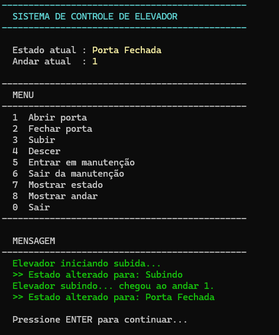
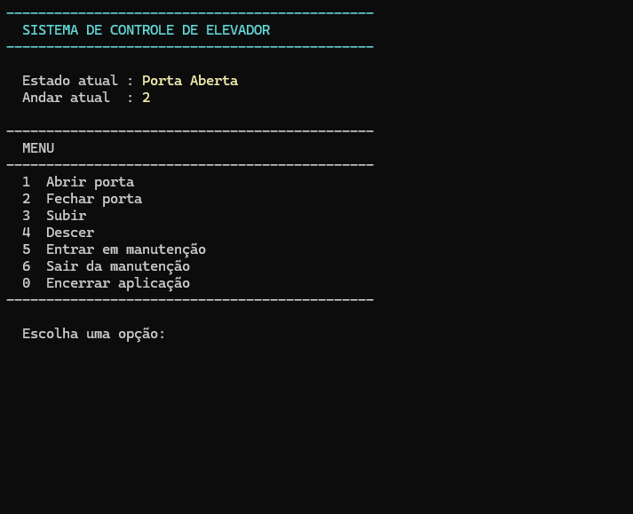
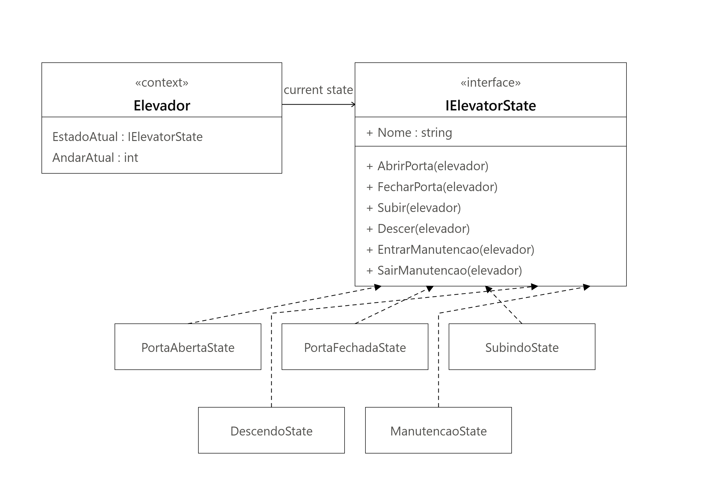

# Sistema de Controle de Elevador — Padrão State (C#)


[](LICENSE)

Aplicação de console em C# que demonstra a aplicação do padrão de projeto **State (GoF)** através da simulação de um elevador, cujo comportamento muda completamente de acordo com o estado em que se encontra.

## Descrição

Um elevador é um exemplo natural de máquina de estados: as mesmas ações (abrir porta, subir, entrar em manutenção) precisam se comportar de forma completamente diferente dependendo da condição atual do equipamento. Abrir a porta é uma operação válida quando o elevador está parado, mas deve ser recusada enquanto ele está em movimento ou em manutenção.

A forma mais comum — e mais frágil — de resolver isso é com uma variável de estado (`enum`) e blocos `if`/`switch` repetidos em cada método, verificando "qual é o estado atual" antes de decidir o que fazer. Esse tipo de código cresce mal: cada novo estado obriga a revisar todos os métodos que já existiam, aumentando o risco de esquecer um caso e violando o princípio Aberto/Fechado.

Este projeto resolve o mesmo problema aplicando o padrão **State**: cada estado do elevador é uma classe independente, responsável apenas pelo próprio comportamento. O elevador (`Context`) não sabe *como* cada estado se comporta — ele apenas delega a operação solicitada ao estado atual e deixa que o polimorfismo resolva o restante.

O projeto foi originalmente desenvolvido como trabalho da disciplina de Programação Orientada a Objetos e, posteriormente, revisado e refinado como estudo de caso da aplicação do padrão State.

---

## Interface da aplicação

Abaixo está a interface principal da aplicação em execução.



---

## Tecnologias

- C# 12
- .NET 8
- Console Application (sem dependências externas)

---

## Conceitos aplicados

- **State Pattern (GoF)** — comportamento do elevador encapsulado em classes de estado intercambiáveis.
- **Polimorfismo** — o `Context` chama sempre os mesmos métodos da interface `IElevatorState`; a implementação executada depende apenas do objeto de estado referenciado em tempo de execução.
- **Encapsulamento** — os membros que alteram o estado interno do elevador (`MudarEstado`, `IncrementarAndar`, `DecrementarAndar` e as instâncias de cada estado) são `internal`. Nada fora do próprio mecanismo de estados pode manipular o elevador ignorando suas regras.
- **Interfaces** — `IElevatorState` define o contrato que todo estado precisa cumprir, sem expor detalhes de implementação.
- **Baixo acoplamento** — nenhum estado conhece os demais diretamente; toda transição passa pelo `Elevador`, que expõe as instâncias de estado necessárias.
- **Responsabilidade única** — cada classe de estado responde apenas pelo comportamento do seu próprio estado.

---

## Estrutura do projeto

```text
ElevadorState/
├── Program.cs
├── Elevator/
│   └── Elevador.cs
├── States/
│   ├── IElevatorState.cs
│   ├── PortaAbertaState.cs
│   ├── PortaFechadaState.cs
│   ├── SubindoState.cs
│   ├── DescendoState.cs
│   └── ManutencaoState.cs
└── assets/
    ├── console.png
    ├── demo.gif
    └── uml.png
```

- **`Elevator/Elevador.cs`** — o `Context` do padrão. Mantém o andar atual e o estado corrente, delegando toda operação ao estado ativo. Não contém regras de negócio.
- **`States/IElevatorState.cs`** — interface que define o contrato comum de todos os estados.
- **`States/*.cs`** — implementações concretas dos estados do elevador.
- **`Program.cs`** — camada de apresentação responsável apenas pela interação com o usuário.

---

## Funcionamento do padrão State

O `Elevador` mantém uma referência ao estado atual através da propriedade `EstadoAtual`, do tipo `IElevatorState`. Todas as operações públicas do elevador (`AbrirPorta()`, `Subir()` etc.) seguem o mesmo formato:

```csharp
public void AbrirPorta() => Console.WriteLine(EstadoAtual.AbrirPorta(this));
```

Não existe, em nenhum lugar do `Elevador`, uma verificação do tipo "se o estado é tal, faça isso". Quem decide o comportamento é sempre o objeto de estado associado no momento — o `Elevador` apenas delega a chamada.

Uma decisão de design importante foi fazer com que os métodos de `IElevatorState` recebam o `Elevador` como parâmetro (`AbrirPorta(Elevador elevador)`), em vez de armazenar uma referência ao contexto em cada estado. Isso torna os estados objetos *stateless*, permitindo que o `Elevador` reutilize uma única instância de cada estado durante toda sua vida útil.

As transições de estado são sempre iniciadas pelo próprio estado concreto através de `elevador.MudarEstado(...)`, mantendo toda a lógica de mudança encapsulada nas classes responsáveis.

---

## Estados implementados

| Estado | Responsabilidade |
|---|---|
| `PortaAbertaState` | Elevador parado com porta aberta. Permite fechar a porta ou entrar em manutenção. |
| `PortaFechadaState` | Estado de repouso. Permite abrir a porta, subir, descer ou entrar em manutenção. |
| `SubindoState` | Controla o movimento de subida e retorna ao estado de repouso após concluir a operação. |
| `DescendoState` | Controla o movimento de descida e retorna ao estado de repouso após concluir a operação. |
| `ManutencaoState` | Bloqueia todas as operações, permitindo apenas sair da manutenção. |

---

## Fluxo de funcionamento

Quando o usuário solicita uma subida:

1. `Program.cs` chama `elevador.Subir()`.
2. O `Elevador` delega a chamada para `EstadoAtual.Subir(this)`.
3. `PortaFechadaState` valida se é possível subir.
4. O estado muda para `SubindoState`.
5. `SubindoState` realiza o movimento, incrementa o andar e retorna para `PortaFechadaState`.

Essa mesma chamada produz resultados completamente diferentes dependendo do estado atual, sem necessidade de estruturas condicionais no `Context`.

---

## Demonstração

A animação abaixo apresenta uma execução da aplicação demonstrando as principais transições de estado.



---

## Diagrama UML

O diagrama abaixo representa a arquitetura utilizada para implementar o padrão State.



---

## Como executar

Pré-requisito:

- .NET 8 SDK instalado.

```bash
git clone https://github.com/SEU-USUARIO/state-pattern-elevator.git

cd state-pattern-elevator

dotnet run
```

---

## Possíveis melhorias futuras

- Configurar o andar máximo através do construtor do `Elevador`.
- Adicionar um novo estado (`EmergenciaState`) para demonstrar a extensibilidade do padrão.
- Escrever testes unitários para validar todas as transições de estado.

---

## Aprendizados

Este projeto permitiu compreender, na prática, como o padrão State elimina grandes estruturas condicionais e distribui o comportamento entre classes especializadas.

Durante a evolução do projeto também ficou evidente a importância do encapsulamento. Restringir métodos responsáveis por alterar o estado interno (`internal`) impediu que qualquer código externo pudesse violar as regras do elevador, tornando a implementação mais consistente e aderente aos princípios da orientação a objetos.

Além disso, revisar o próprio código após a conclusão do trabalho mostrou como pequenos refinamentos arquiteturais podem melhorar significativamente a qualidade de uma implementação sem alterar sua funcionalidade.

---

## Licença

Este projeto está licenciado sob a licença MIT. Consulte o arquivo **LICENSE** para mais informações.